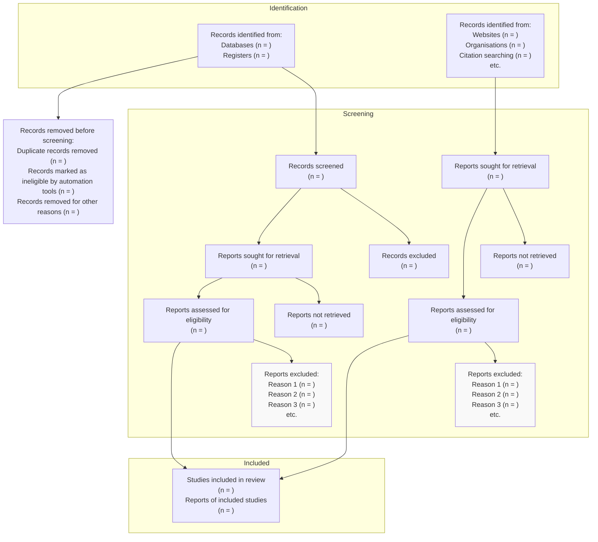

# PRISMA 2020 Flow Diagram

Source: https://www.prisma-statement.org/

*Consider, if feasible to do so, reporting the number of records identified from each database or register searched (rather than the total number across all databases/registers).

**If automation tools were used, indicate how many records were excluded by a human and how many were excluded by automation tools.

From: Page MJ, et al. BMJ 2021;372:n71. doi: 10.1136/bmj.n71.  
This work is licensed under CC BY 4.0. To view a copy of this license, visit https://creativecommons.org/licenses/by/4.0/
